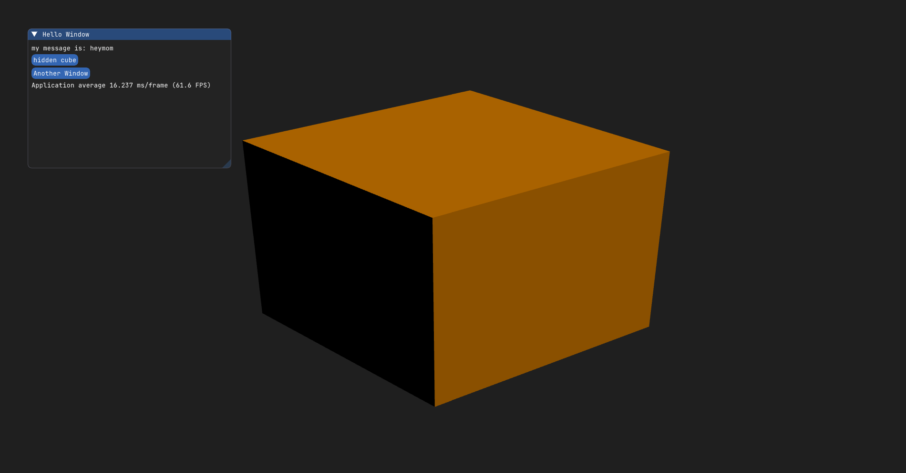

# Simple-Magnum-Gui (SMG)

A simple gui to generate a window and allow plotting.
Great for quick debugging and drawing of data. 

Magnum gives easy opengl support.

Make sure to clone the submodules too.

`git submodule init`
`git submodule update`

### Dependencies

This utilizes Dear ImGui, Magnum, ImPlot.  
[Corrade](github.com/mosra/corrade)  
[Magnum](github.com/mosra/magnum)  
[magnum-integration](https://github.com/mosra/magnum-integration)  
[imgui](https://github.com/ocornut/imgui)  * cloned into src/MagnumExternal/ImGui directory
add implot and implot3

### Linux dependencies
Build with the `make deps`
and `make`
make sure to add a LD_LIBRARY_PATH
`export LD_LIBRARY_PATH=/home/you/programs/simple-magnum-gui/.deps/usr/lib:${LD_LIBRARY_PATH}`
to find the libraries

#### Windows dependencies
Use vpckg to install other dependencies.
[vcpkg](https://github.com/microsoft/vcpkg)

Make sure you are in classic mode and install 

1. SDL2
2. Freetype
3. libjpeg-turbo

# make sure to add the dll libraries to path 
$env:PATH="C:\Users\you\programs\simple-magnum-gui\.deps\usr\bin;$env:PATH"

and SDL2 from vcpkg

$env:PATH="C:\Users\you\programs\vcpkg\installed\x64-windows\bin;$env:PATH"

## legacy dependencies
These are encapsulated into the dependencies directory.  
The cmake commands are implemented in shell script wrappers in the
`scripts` directory. 
FYI both of the above scripts install to `~/.local`. 

 ## utilizing the library
Gui uses a naive callback system to enable different systems.
See the examples
 * Start the gui window with GuiBase
 * create a DrawCallback
    * set your static callback function with prototype 
        ` int callback_function(void* data); `
    * set any events (mouse move, mouse scroll, key press) with the relevant prototypes
    * set your data
* add the callback to your guibase object
* run your game loop and call the gui function `mainLoopIteration`

