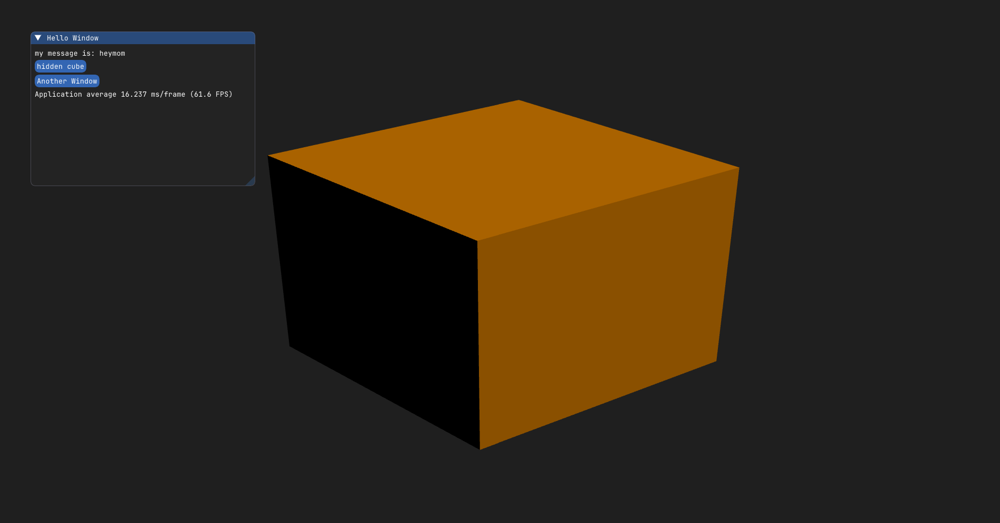

# Simple-Magnum-Gui (SMG)

A simple GUI for generating windows and plotting data. Great for quick debugging and visualization.



## Getting Started

Clone with submodules:
```bash
git clone --recurse-submodules https://github.com/kolbbond/simple-magnum-gui.git
```

Or if already cloned:
```bash
git submodule update --init --recursive
```

## Dependencies

Built on [Magnum](https://github.com/mosra/magnum) for OpenGL support, with:
- [Corrade](https://github.com/mosra/corrade)
- [magnum-integration](https://github.com/mosra/magnum-integration)
- [Dear ImGui](https://github.com/ocornut/imgui)
- [ImPlot](https://github.com/epezent/implot)
- [ImPlot3D](https://github.com/brenocq/implot3d)

### Linux

Build dependencies and project:
```bash
make deps
make
```

Add library path:
```bash
export LD_LIBRARY_PATH=/path/to/simple-magnum-gui/.deps/usr/lib:${LD_LIBRARY_PATH}
```

### Windows

Use vcpkg (classic mode) for SDL2/Freetype/libjpeg-turbo:
```powershell
git clone https://github.com/microsoft/vcpkg.git
cd vcpkg
.\bootstrap-vcpkg.bat
$env:VCPKG_ROOT = "$pwd"
[Environment]::SetEnvironmentVariable("VCPKG_ROOT", $env:VCPKG_ROOT, "User")
& "$env:VCPKG_ROOT\vcpkg.exe" install sdl2 freetype libjpeg-turbo
```

Open an x64 MSVC environment (Developer PowerShell or DevShell) with `ninja` on PATH, then build:
```powershell
cmake --preset windows-vcpkg
cmake --build build --config Debug
```

If running from the build tree, set plugin and SDL2 paths:
```powershell
$env:MAGNUM_PLUGINS_DEBUG_DIR="$pwd\build\bin\magnum-d"
$env:PATH="$env:VCPKG_ROOT\installed\x64-windows\debug\bin;$env:PATH"
```

## Usage

The GUI uses a callback system:

1. Start a window with `GuiBase`
2. Create a `DrawCallback`:
   - Set your callback function: `int callback_function(void* data);`
   - Set event handlers (mouse move, scroll, key press)
   - Set your data pointer
3. Add the callback to your `GuiBase` object
4. Run your loop calling `mainLoopIteration`

See the examples for details.

## Legacy

Legacy Linux scripts in `scripts/` install to `~/.local`.

