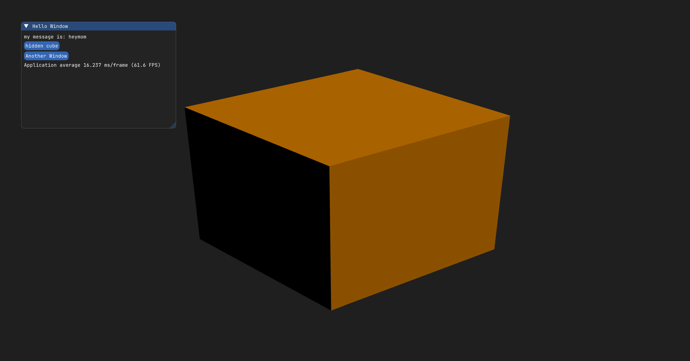
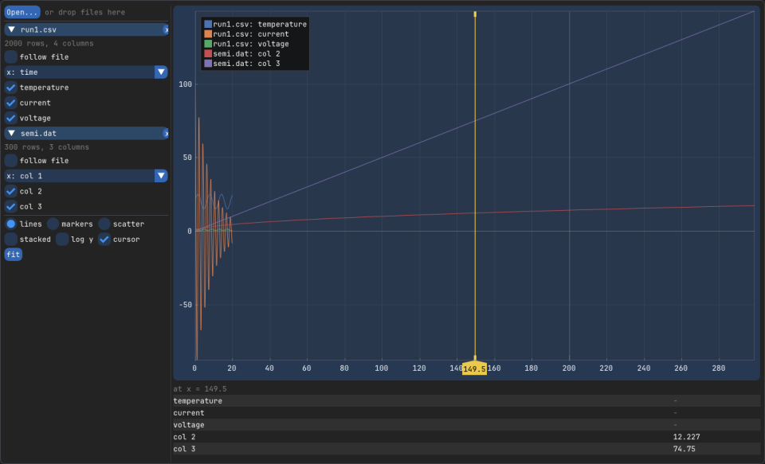
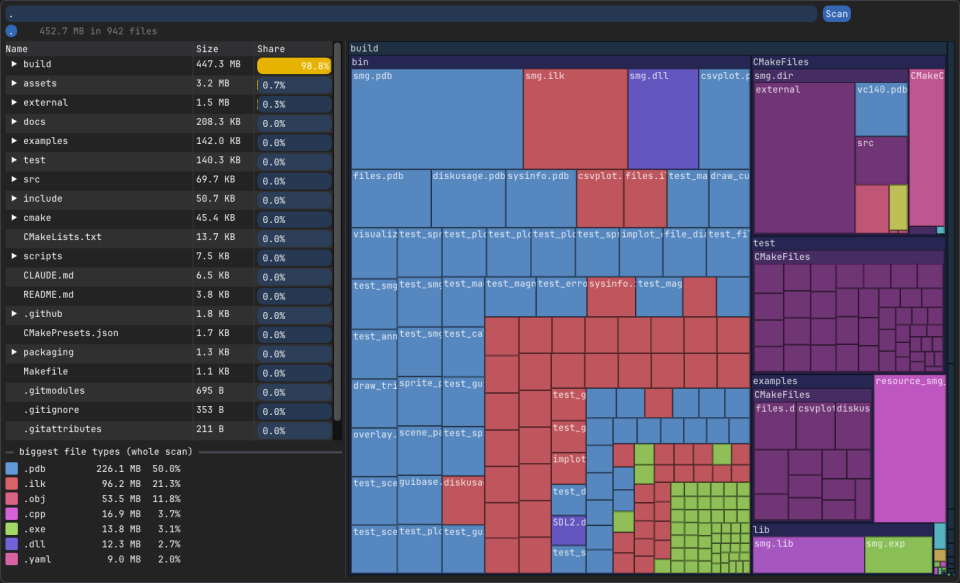
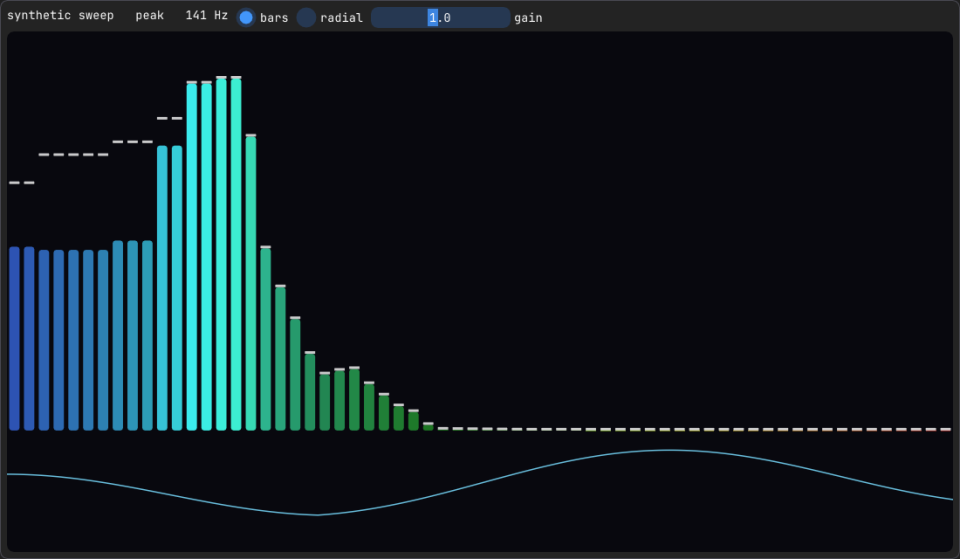
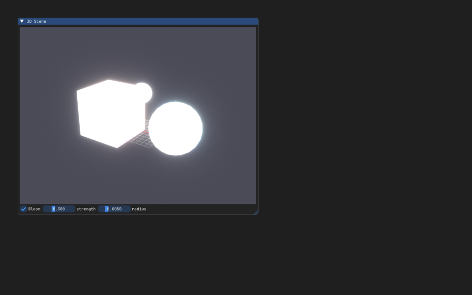

# Simple-Magnum-Gui (SMG)

A small C++ GUI toolkit on [Magnum](https://github.com/mosra/magnum) + [Dear ImGui](https://github.com/ocornut/imgui):
open a window, hand it a lambda, and draw ImGui widgets, [ImPlot](https://github.com/epezent/implot)
plots and OpenGL scenes. Good for quick tools, debugging views and data visualization.



| | |
|---|---|
|  |  |
|  |  |

## Features

- **`GuiBase`** — window + ImGui/ImPlot/ImPlot3D context and a per-frame callback loop; MSAA,
  HiDPI fonts, docking
- **`ScenePanel`** — a 3D viewport inside an ImGui window (orbit camera, meshes, bloom), iso sprites
- **Plots** — `Plot`/`Plot3D` helpers over ImPlot; `Anim`/`Timeline` keyframes and easing;
  on-screen annotations
- **`FileDialog`** — open/save pickers
- **Overlays** — transparent, borderless, always-on-top windows with click-through (Windows)
- **Capture** — screenshots, frame recording and hidden off-screen rendering, from code or the
  command line (below), which also makes every app testable in CI without a display

## Getting Started

Clone with submodules:
```bash
git clone --recurse-submodules https://github.com/kolbbond/simple-magnum-gui.git
```

Or if already cloned:
```bash
git submodule update --init --recursive
```

## Dependencies

Built on [Magnum](https://github.com/mosra/magnum) for OpenGL support, with:
- [Corrade](https://github.com/mosra/corrade)
- [magnum-integration](https://github.com/mosra/magnum-integration)
- [Dear ImGui](https://github.com/ocornut/imgui)
- [ImPlot](https://github.com/epezent/implot)
- [ImPlot3D](https://github.com/brenocq/implot3d)

### Linux

Build dependencies and project:
```bash
make deps
make
```

Add library path:
```bash
export LD_LIBRARY_PATH=/path/to/simple-magnum-gui/.deps/usr/lib:${LD_LIBRARY_PATH}
```

### Windows

Use vcpkg (classic mode) for SDL2/Freetype/libjpeg-turbo:
```powershell
git clone https://github.com/microsoft/vcpkg.git
cd vcpkg
.\bootstrap-vcpkg.bat
$env:VCPKG_ROOT = "$pwd"
[Environment]::SetEnvironmentVariable("VCPKG_ROOT", $env:VCPKG_ROOT, "User")
& "$env:VCPKG_ROOT\vcpkg.exe" install sdl2 freetype libjpeg-turbo
```

Open an x64 MSVC environment (Developer PowerShell or DevShell) with `ninja` on PATH, then build:
```powershell
cmake --preset windows-vcpkg
cmake --build build --config Debug
```

If running from the build tree, set plugin and SDL2 paths:
```powershell
$env:MAGNUM_PLUGINS_DEBUG_DIR="$pwd\build\bin\magnum-d"
$env:PATH="$env:VCPKG_ROOT\installed\x64-windows\debug\bin;$env:PATH"
```

### WebAssembly (Emscripten)

The WASM build cross-compiles with Emscripten via the wrapper script
`scripts/build_wasm.sh`. Use the script rather than a bare `cmake` invocation:
cross-compiling Magnum needs a **native** `corrade-rc` for resource compilation,
which the script builds first (into `build-native/`) and passes through as
`CORRADE_RC_EXECUTABLE`.

Prerequisite: an activated [emsdk](https://emscripten.org/docs/getting_started/downloads.html).
The script finds it in this order — `emcc` already on `PATH`, then `$EMSDK_PATH`,
then `$EMSDK` (exported by `emsdk_env.sh`):

```bash
# either activate emsdk in your shell first...
source /path/to/emsdk/emsdk_env.sh
./scripts/build_wasm.sh

# ...or point the script at your emsdk install
EMSDK_PATH=/path/to/emsdk ./scripts/build_wasm.sh
```

Output (the WASM build dir) lands in `build-wasm/`. The build forces a static
library (`BUILD_SHARED_LIBS=OFF`) and uses `EmscriptenApplication` instead of
SDL2 (see `GuiBase.hh`).

## Usage

```cpp
#include "GuiBase.hh"
#include "imgui.h"

int main(int argc, char** argv) {
    smg::GuiConfig config;            // title, size, MSAA samples, overlay/hidden options
    config.title = "hello";
    smg::GuiBase gui({ argc, argv }, config);

    float value = 0.5f;
    gui.add_callback([&]() {          // runs every frame, between ImGui's new-frame and draw
        ImGui::Begin("controls");
        ImGui::SliderFloat("value", &value, 0.0f, 1.0f);
        ImGui::End();
        return 0;
    });

    while(gui.mainLoopIteration()) {}
}
```

Callbacks run in registration order; `add_callback` returns a handle for `remove_callback`.
`gui.dt()` is the frame time. If you render into your own framebuffers, bind
`smg::GuiBase::main_framebuffer()` afterwards rather than `GL::defaultFramebuffer`, so hidden
(off-screen) mode keeps working.

### Command line

Every smg app understands:

| option | |
|---|---|
| `--smg-frames N` | exit after N frames |
| `--smg-screenshot out.png` | save the last frame (after 60 frames unless `--smg-frames` says otherwise) and exit |
| `--smg-record DIR` | save every frame as `DIR/frame_00000.png` |
| `--smg-hidden` | render off-screen, no window |

From code: `gui.screenshot(path)`, `gui.start_recording(dir)`, `gui.grab()`. PNGs are compressed
when Magnum's image converter plugins are installed and written uncompressed by a built-in encoder
otherwise.

## Examples

| example | |
|---|---|
| `guibase`, `draw_triangle`, `draw_cube` | the basics: a window, a mesh in a callback, a lit 3D cube |
| `implot_ex` | ImPlot / ImPlot3D demos |
| `scene_panel`, `sprite_panel` | 3D viewport with orbit camera and bloom; iso sprites |
| `file_dialog` | open / save pickers |
| `csvplot` | drop CSV files and plot columns: auto-detected delimiter/header, overlaid or stacked plots, value cursor, follows files that are still being written |
| `diskusage` | where the space went: background scan, size-sorted tree and nested treemap, biggest file types |
| `files` | fast file browser: instant filter, recursive search, text/image preview |
| `sysinfo` | system monitor: per-core CPU, threads, memory, processes, disks, network, GPUs |
| `visualizer` | audio spectrum, radial view and waveform from the default input, a WAV, or `--tone` |
| `overlay` | transparent always-on-top HUD; drag to move, Ctrl+Alt+O toggles click-through |

All of them use only smg's own dependencies (plus OS system libraries). `ctest -L example` renders
each one hidden and saves `build/examples/shots/<name>.png`. On WebAssembly only `guibase` is built
so far; the others rely on threads, the filesystem or OS APIs that a browser doesn't offer.

### Windows package

`cpack` in the build directory produces `package/smg-examples-<version>-win64.zip` and an NSIS
installer: the examples plus every DLL and Magnum plugin they load, runnable on a machine without
any of the dependencies installed.

## Acknowledgements

- **Bloom effect** — the `ScenePanel` glow uses
  [magnum-bloom](https://gitlab.com/jeroen.van.nugteren/magnum-bloom) by
  **Jeroen van Nugteren** (Unlicense / public domain), a mip-chain physically
  based bloom renderer for Magnum. The sources are vendored under
  `external/bloom/`; see `external/bloom/PROVENANCE.md` for details.
- **File dialog** — `smg::FileDialog` wraps
  [ImGuiFileDialog](https://github.com/aiekick/ImGuiFileDialog) by
  **Stephane Cuillerdier (Aiekick)** (MIT). Vendored under
  `external/imguifiledialog/` from the Project-Rat fork (adds a re-init fix by
  Jeroen van Nugteren); see `external/imguifiledialog/PROVENANCE.md`.

## Legacy

Legacy Linux scripts in `scripts/` install to `~/.local`.

